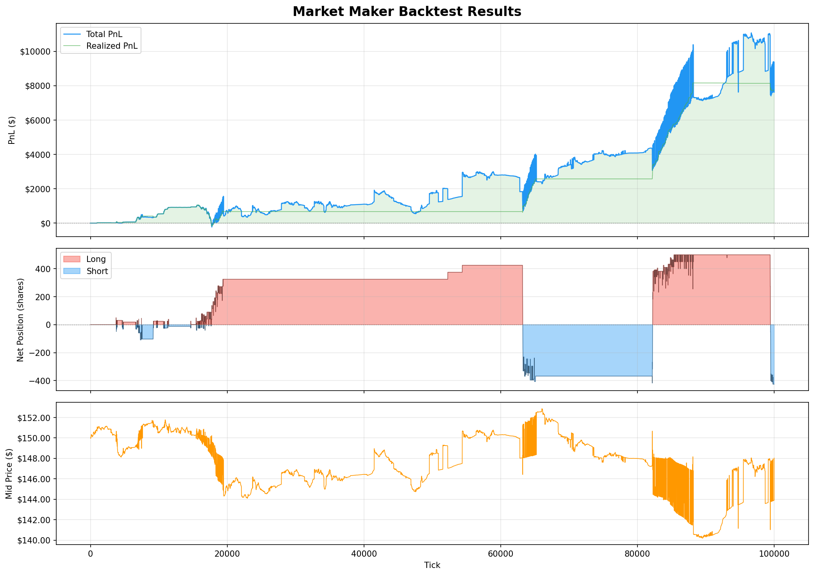

# Ultra-Low Latency Limit Order Book Engine

A multi-threaded exchange emulator in C++ with a matching engine, pre-trade risk controls, and a market-making strategy with inventory risk management. Built following modern HFT systems design principles — zero heap allocations on the critical path, lock-free inter-thread communication, and sub-microsecond matching latency.

~2,200 lines of C++ across 15 source files, plus 49 automated tests and Python tooling for load testing, market data, and PnL visualization.

## Architecture

```
                           ┌─────────────────────────────────────────────────┐
                           │              THREAD 1: Network I/O              │
  TCP Client               │                                                 │
  (replayer.py)  ────────► │  TCP Socket ──► FIX Parser ──► Ring Buffer      │
                           │                                  (Lock-Free     │
                           │                                   SPSC Queue)   │
                           └───────────────────────────┬─────────────────────┘
                                                       │
                                          push() with memory_order_release
                                                       │
                                                       ▼
                           ┌─────────────────────────────────────────────────┐
                           │           THREAD 2: Matching Engine             │
                           │                                                 │
                           │  Ring Buffer ──► Risk Engine ──► Memory Pool    │
                           │                       │              │          │
                           │                   reject?         acquire()     │
                           │                   return;            │          │
                           │                                      ▼          │
  UDP Multicast            │                              Order Book         │
  (market_data_    ◄────── │  UDP Publisher ◄── BBO ◄── (Price-Time          │
   listener.py)            │                             Priority)           │
                           └─────────────────────────────────────────────────┘
```

The system decouples network I/O from order processing using a lock-free SPSC ring buffer. The network thread reads TCP bytes, parses FIX messages, and pushes them into the queue. The engine thread busy-waits on the queue, runs pre-trade risk checks, and dispatches to the matching engine. BBO updates are broadcast over UDP multicast after every trade that changes the top of book.

## Performance

Benchmarked on Apple Silicon (macOS) without kernel-bypass networking.

| Metric | Value | What It Measures |
|:---|:---|:---|
| Matching Latency (p50) | ~50 ns | Order book lookup + linked list traversal + trade recording |
| Matching Latency (p99) | ~730 ns | Worst-case with cache misses and BBO publish |
| Pipeline Latency | ~200 ns | Full path: FIX parse → risk check → pool acquire → match |
| Throughput | >4M orders/sec | Sustained rate through the end-to-end pipeline |

## Components

### Matching Engine — `OrderBook.cpp`, `types.h`

The order book uses a `std::map<Price, PriceLevel>` for each side — bids sorted descending (highest first), asks sorted ascending (lowest first). Each `PriceLevel` contains a doubly-linked list of `Order` structs, giving O(1) insertion at the tail and O(1) removal from any position.

Orders are matched using **price-time priority**: the best-priced resting order fills first, and among orders at the same price, the oldest fills first (FIFO). The engine supports limit orders, market orders (which sweep through price levels without a price constraint), cancellations, and cancel/replace modifications.

**Cancel/Replace** follows standard exchange rules for time priority:
- Quantity decrease at the same price → keeps queue position (reducing risk shouldn't be punished)
- Price change or quantity increase → loses queue position (treated as a new order)

### Pre-Trade Risk Engine — `Riskengine.h`

Every order passes through five checks before touching the book, ordered from cheapest to most expensive (fail-fast):

1. **Validity** (~1ns) — reject zero quantity or negative price on limit orders
2. **Fat Finger Size** (~1ns) — reject orders above a configurable max quantity
3. **Fat Finger Notional** (~2ns) — reject orders where price × quantity exceeds max dollar exposure
4. **Price Collar** (~5ns) — reject orders whose price deviates more than 5% from the current market midpoint
5. **Rate Limit** (~10ns) — reject when message count exceeds the per-window threshold

Rejected orders never touch the memory pool or the order book. The risk engine maintains statistics (pass rate, rejection breakdown) for monitoring.

### Lock-Free Ring Buffer — `RingBuffer.h`

SPSC (Single-Producer, Single-Consumer) circular queue using `std::atomic` with acquire/release memory ordering. The producer (network thread) writes at `head`, the consumer (engine thread) reads at `tail`. No mutexes, no system calls, no context switches.

Capacity is a power of 2 (131,072 slots) so the modulo operation compiles to a single bitwise AND. The consumer thread uses a busy-wait loop — 100% CPU utilization on one core, but wake-up latency is limited to cache coherence propagation time (~20-80ns) rather than OS scheduler latency (~5,000-50,000ns with condition variables).

### Memory Pool — `MemoryPool.h`

Pre-allocates 200,000 `Order` objects at startup. `acquire()` pops from a free list (O(1)), `release()` pushes back. No heap allocation or deallocation on the hot path. `Order` structs are aligned to 64-byte cache lines (`alignas(64)`) to prevent false sharing between CPU cores.

### FIX Protocol Parser — `FixParser.h`, `FixParser.cpp`

Single-pass, zero-allocation parser for FIX 4.2 messages. Walks the byte buffer character-by-character, identifies tag=value pairs separated by SOH delimiters, and writes results into a flat `ParsedFixMessage` struct. Prices are parsed into fixed-point integers (4 implied decimal places) to avoid floating-point arithmetic in the matching engine. Order IDs are stored as `string_view` (pointing into the original buffer) to avoid string copies.

Supported message types: New Order Single (35=D), Cancel Request (35=F), Cancel/Replace Request (35=G).

### Market Data Feed — `UdpPublisher.h`, `MarketData.h`

BBO updates are sent as raw packed structs over UDP multicast (239.255.0.1:3050). The `BboMessage` struct uses `#pragma pack(push, 1)` to eliminate compiler padding, ensuring the byte layout matches between the C++ sender and the Python receiver. A single `sendto()` call transmits 33 bytes per update with no serialization overhead.

### Market-Making Strategy — `Marketmaker.h`, `Simulator.cpp`

An Avellaneda-Stoikov inspired market maker that quotes a bid and ask around the midpoint and manages inventory risk through three mechanisms:

**Inventory Skew** — The core risk control. Both quotes shift proportionally to current inventory:
```
skew = netPosition × skewPerUnit
bid  = midPrice - halfSpread - skew
ask  = midPrice + halfSpread - skew
```
When long, quotes shift down (discouraging buys, encouraging sells). When short, quotes shift up. This creates a self-correcting feedback loop that pulls inventory back toward zero.

**Position Limits** — Hard cap on maximum net exposure (default ±500 shares). When the limit is reached, the quote on the accumulating side is pulled entirely. Quote sizes are dynamically reduced as the position approaches the limit to prevent overshoot.

**Kill Switch** — If total PnL (realized + unrealized) drops below a configurable threshold (default -$5,000), all quotes are immediately cancelled and the strategy stops trading.

The simulator generates realistic synthetic order flow: prices follow a random walk, order sizes are exponentially distributed, and the tick-by-tick mix of limit orders (60%), market orders (15%), cancels (15%), and quiet ticks (10%) approximates real market microstructure.

**Sample Backtest (100,000 ticks):**

| Metric | Value |
|:---|:---|
| Total Fills | 1,435 |
| Total PnL | $9,379 |
| Realized PnL | $7,737 |
| Max Drawdown | $3,957 |
| PnL per Fill | $6.54 |
| Max Position | ±500 shares |



## Test Suites

49 automated tests across two suites, covering the matching engine, risk engine, and full FIX pipeline integration.

**Risk Engine Tests** (24 tests) — validity checks, fat-finger rejection, price collar math (including exact boundary conditions), rate limiting, fail-fast ordering verification, and full pipeline integration (FIX parse → risk check → match → verify trade log).

**Matching Engine Tests** (25 tests) — limit/market order matching, price-time priority (FIFO at same price, better price fills first), cancel correctness (including middle-of-queue removal), modify with priority preservation (qty-down keeps position, qty-up/price-change loses position), full FIX cancel/replace pipeline, and edge cases (empty book accessors, multi-level sweeps, VWAP calculation).

## Build and Run

**Exchange server:**
```bash
g++ -O3 -std=c++17 -march=native -pthread main.cpp FixParser.cpp OrderBook.cpp -o lob_server
./lob_server
```

**Market data listener** (separate terminal):
```bash
python3 market_data_listener.py
```

**Load injector** (separate terminal — sends 100K FIX orders over TCP):
```bash
python3 replayer.py
```

**Market maker backtest:**
```bash
g++ -O3 -std=c++17 -march=native -pthread Simulator.cpp FixParser.cpp OrderBook.cpp -o simulator
./simulator
python3 plot_backtest.py    # generates pnl_curve_report.png
```

**Test suites:**
```bash
g++ -O3 -std=c++17 -pthread test_risk_engine.cpp FixParser.cpp OrderBook.cpp -o test_risk
g++ -O3 -std=c++17 -pthread test_matching_engine.cpp FixParser.cpp OrderBook.cpp -o test_engine
./test_risk && ./test_engine
```

## File Structure

```
├── types.h                    Core types: Order, PriceLevel, Trade, Side
├── OrderBook.h / .cpp         Matching engine (price-time priority)
├── MemoryPool.h               Pre-allocated object pool for Order structs
├── RingBuffer.h               Lock-free SPSC queue (acquire/release atomics)
├── FixParser.h / .cpp         Zero-allocation FIX 4.2 protocol parser
├── OrderEntryGateway.h        Message routing + FIX-to-internal translation
├── Riskengine.h               Pre-trade risk checks (5-stage pipeline)
├── Marketmaker.h              Market-making strategy with inventory skew
├── MarketData.h               Packed BBO struct for UDP wire format
├── UdpPublisher.h             UDP multicast publisher
├── LatencyTracker.h           Nanosecond percentile statistics
├── main.cpp                   Server entry point + benchmarks
├── Simulator.cpp              Backtest harness with synthetic order flow
├── test_risk_engine.cpp       24 risk engine unit tests
├── test_matching_engine.cpp   25 matching engine + modify tests
├── replayer.py                TCP load injector (100K FIX messages)
├── market_data_listener.py    UDP multicast BBO receiver
└── plot_backtest.py           PnL curve visualization
```

## Design Decisions

**Fixed-point prices** instead of floating-point — prices are stored as `int64_t` with 4 implied decimal places ($150.00 = 1,500,000). This eliminates floating-point comparison issues in the matching engine and makes price arithmetic exact.

**`std::map` for price levels** instead of a flat array — the map gives O(log n) insertion and sorted iteration, which matters when the price range is wide or unknown. A flat array would give O(1) access at a known price but waste memory and require knowing the price bounds upfront. For a general-purpose exchange with variable instruments, the map is the standard production choice.

**Doubly-linked list for order queue** instead of `std::deque` — enables O(1) removal of any order by ID (via the `orderMap` hash table), which is critical for cancel and modify operations. A deque would require O(n) search to find and remove an order from the middle.

**Risk checks before pool allocation** — rejected orders never consume a pool slot or touch the order book. A flood of invalid orders (from a buggy client or an attack) can't exhaust the memory pool or slow down matching for valid orders.

**Cancels bypass risk** — cancellations reduce exposure. Subjecting them to collar checks or rate limits would delay risk reduction, which is the opposite of what you want in a risk event.

**Busy-wait over condition variables** — the matching engine thread spins at 100% CPU utilization, but wake-up latency is bounded by cache coherence (~50ns) instead of OS scheduling (~10,000ns+). This is the standard tradeoff in latency-sensitive systems: you dedicate a physical core to polling in exchange for deterministic response time.
